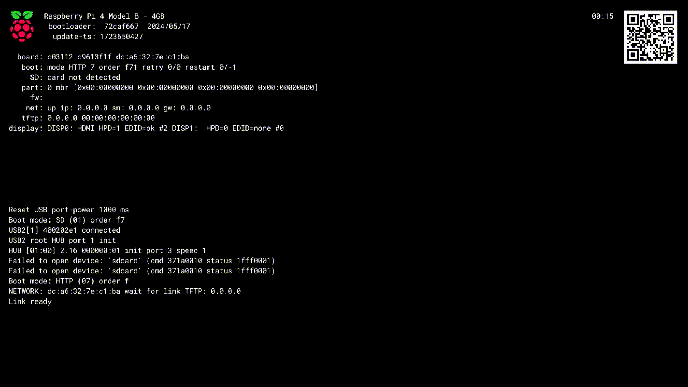

# MiniPiBoot

*Disclaimer, this is probably not even close to being reproducible these are just quick notes!*

I was looking for a way to boot a pi quickly.  tftp is a bit slow, turns out there's now a "Mode 7" to boot a pi with HTTP if you make your own image, this comes from the "hold shift to boot a recovery" deal, turns out you can exploit this to load your own dot img file.  Nice.


If you want to use https://buildroot.org you can use this as a starter, have a look at how the raspberry folks do this to make their network boot image over here:  https://github.com/raspberrypi/rpi-imager/ the good stuff is in the "embedded" directory.  In the end I just used a regular ```make raspberrypi4_64_defconfig``` from ```make list-defconfigs``` in buildroot, then in the style of rpi-imager copied out the stuff I needed and used ```make-boot-image``` from https://github.com/raspberrypi/usbboot/tree/master/tools.  

The stuff you need to copy out is just this shell code below - we configured an initrd so we switch out all the /dev/mmcblk stuffs in cmdline.txt to /dev/ram0.  Took a bit of fiddling did that.

```bash
#!/bin/sh

set -e
BUILDROOT=./

#
# Copy the files we are interested in from buildroot's "output/images" directory
# to our "output" directory in top level directory 
#

rm -rf cuff
mkdir cuff

# Copy Linux kernel and initramfs
cp "${BUILDROOT}/output/images/rootfs.cpio.zst" "${BUILDROOT}/output/images/Image.gz" cuff
# Raspberry Pi firmware files
cp "${BUILDROOT}/output/images/rpi-firmware/start4.elf" cuff
cp "${BUILDROOT}/output/images/rpi-firmware/fixup4.dat" cuff
cp "${BUILDROOT}/output/images/rpi-firmware/config.txt" cuff

echo "root=/dev/ram0 rootwait console=tty1 console=ttyAMA0,115200" > cuff/cmdline.txt

# Not used by Pi 4, but need to be present to make usbboot think it is a valid directory
touch cuff/bootcode.bin

cp ${BUILDROOT}/output/images/bcm2711*.dtb cuff/

mkdir -p cuff/overlays

cp ${BUILDROOT}/output/images/rpi-firmware/overlays/* cuff/overlays/

echo
echo Build complete. Files are in output folder.
echo
```


Here's what you need to do on your pi to get it ready to take a signed .img file (only need to do this once - KEEP THAT private.pem safe!!), starting with a standard [PiOS image, I use the lite ones](https://www.raspberrypi.com/software/operating-systems/)

1. Make a private key (keep this safe):
   ```openssl genrsa -out private.pem 2048```


2. Sign your eeprom:
   ```
      rpi-eeprom-config -c boot.conf -p private.pem -o pieeprom.upd pieeprom.original.bin
      rpi-eeprom-digest -i pieeprom.upd -o pieeprom.sig
   ```


3. Flash it, and reboot so it takes.
```rpi-eeprom-update -f ./pieeprom.upd```

4. Sign your new boot.img you have created with buildroot: ```rpi-eeprom-digest -i boot.img -o boot.sig -k private.pem```

5. Copy .img and .sig to your webserver.  You can use this if you have done something like the buildroot above, and happen to be running a pi.hole (there's a handy little webserver already stood up that you can use to shell to your server and sign the code):

```bash
jcuff@amdmini:~/MiniPiBoot/buildroot-2024.05.1$ cat makeimage.sh 
sudo ../usbboot/tools/make-boot-image -b pi4 -d ./cuff/ -o boot.img
echo copying to pi.hole
sudo scp boot.img pi.hole:/var/www/html/pi/boot.img
echo signing binary...
sudo ssh pi.hole "/var/www/html/pi/pistuff/rpi-eeprom/rpi-eeprom-digest \
	-i /var/www/html/pi/boot.img \
	-o /var/www/html/pi/boot.sig \
	-k /var/www/html/pi/pistuff/private.pem"
```

6. Boot your pi - Enjoy.

7. Spend hours fiddling with buildroot so your initrd is nice and awesome - remember, there's a limit for these img files - 96MB tops, so keep it tight!


Video grab from a HDMI USB connector through QuickTime and then courtesy of old faithful to turn it into a gif.

```ffmpeg -i piboot.mov -pix_fmt rgb8 -r 10 output.gif && gifsicle -O3 output.gif -o output.gif```




Update - uploaded the WORKINGPICUFFBUILDROOT.img if you want to give it a whirl, you'll need to sign it with your own private.pem.  Careful, it's a HUGE download nearly 32MB.  If you want to see what's in it you can:

```bash
jcuff@amdmini:~/MiniPiBoot/buildroot-2024.05.1$ mkdir tt ; sudo mount -o loop WORKINGPICUFFBUILDROOT.img tt
[sudo] password for jcuff: 

jcuff@amdmini:~/MiniPiBoot/buildroot-2024.05.1$ ls -lrta tt
total 31694
drwxr-xr-x  3 root  root      8192 Jan  1  1970 .
-rwxr-xr-x  1 root  root   2257216 Aug 14 15:30 start4.elf
-rwxr-xr-x  1 root  root  21277006 Aug 14 15:30 rootfs.cpio.zst
drwxr-xr-x  2 root  root     26624 Aug 14 15:30 overlays
-rwxr-xr-x  1 root  root   8811093 Aug 14 15:30 Image.gz
-rwxr-xr-x  1 root  root      5436 Aug 14 15:30 fixup4.dat
-rwxr-xr-x  1 root  root       965 Aug 14 15:30 config.txt
-rwxr-xr-x  1 root  root        60 Aug 14 15:30 cmdline.txt
-rwxr-xr-x  1 root  root     54707 Aug 14 15:30 bcm2711-rpi-4-b.dtb
drwxr-xr-x 20 jcuff jcuff     4096 Aug 14 16:29 ..

```


